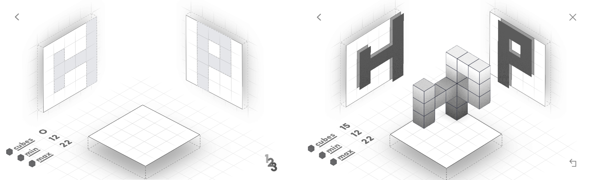
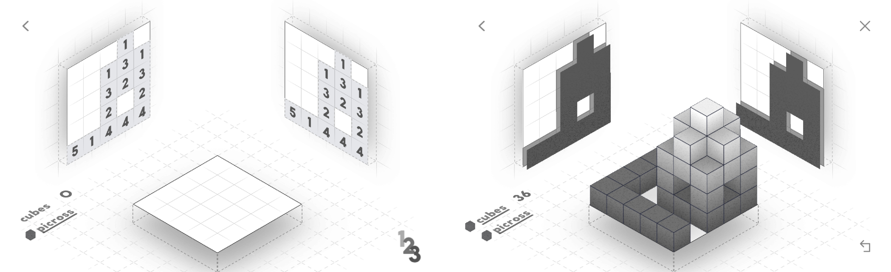

# 3D-Puzzle

A small REPL application used to solve levels from the 
[.projekt game](https://play.google.com/store/apps/details?id=com.stampedegames.projekt&hl=en_US) for Android. This
project originally only consisted of algorithms to solve levels, the REPL was added later for the fun of it.


## Example


The level and corresponding solution, shown above would be represented as follows:
```text
left side: 5 x 5, right side: 5 x 5, mode: normal

' ' ' ' X    ' X X X '    z=4
' X ' ' X    ' X ' X '    z=3
' X X X X    ' X X X '    z=2
' X ' ' X    ' X ' ' '    z=1
' ' ' ' X    ' X ' ' '    z=0
```

```text
' X ' ' '    ' X ' ' '    ' ' ' X '    ' ' ' X '    ' X X X '    y=4
' ' ' ' '    ' ' ' ' '    ' ' ' X '    ' ' ' ' '    ' ' ' ' '    y=3
' ' ' ' '    ' ' ' ' '    ' ' X ' '    ' ' ' ' '    ' ' ' ' '    y=2
' ' ' ' '    ' X ' ' '    ' X ' ' '    ' X ' ' '    ' ' ' ' '    y=1
' ' ' ' '    ' ' ' ' '    ' ' ' ' '    ' ' ' ' '    ' ' ' ' '    y=0
   z=0          z=1          z=2          z=3          z=4       
```

---



The level in picross mode and the corresponding solution, shown above would be represented as follows:
```text
left side: 5 x 5, right side: 5 x 5, mode: picross

' ' ' 1 '    ' ' ' 1 '    z=4
' ' 1 3 1    ' ' 1 3 1    z=3
' ' 3 2 3    ' ' 3 2 3    z=2
' ' 2 ' 2    ' ' 2 ' 2    z=1
5 1 4 4 4    5 1 4 4 4    z=0
```

```text
X ' X X X    ' ' X ' X    ' ' X X X    ' ' ' X '    ' ' ' ' '    y=4
X ' X X X    ' ' ' ' '    ' ' X ' X    ' ' X X X    ' ' ' X '    y=3
X ' X X X    ' ' X ' X    ' ' X X X    ' ' ' X '    ' ' ' ' '    y=2
X ' ' ' '    ' ' ' ' '    ' ' ' ' '    ' ' ' ' '    ' ' ' ' '    y=1
X X X X X    ' ' ' ' '    ' ' ' ' '    ' ' ' ' '    ' ' ' ' '    y=0
   z=0          z=1          z=2          z=3          z=4       
```
